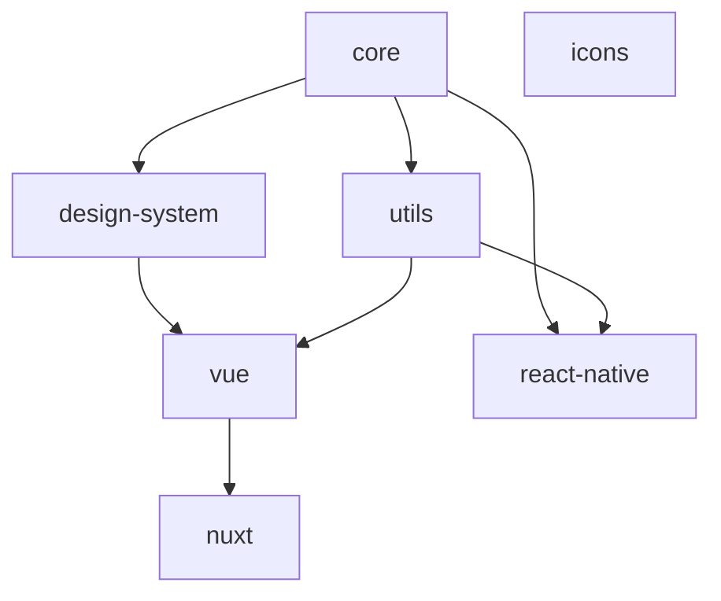
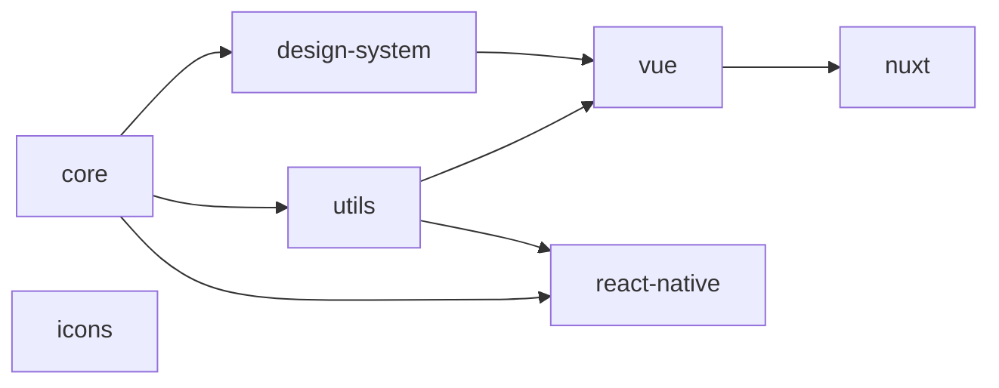
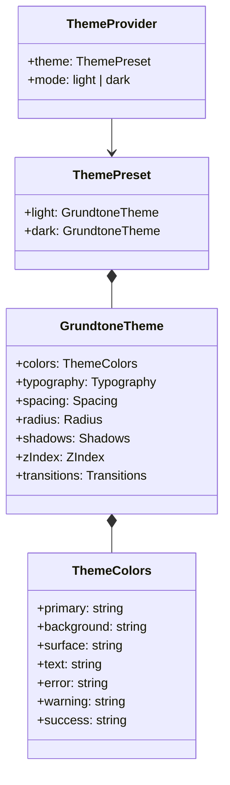
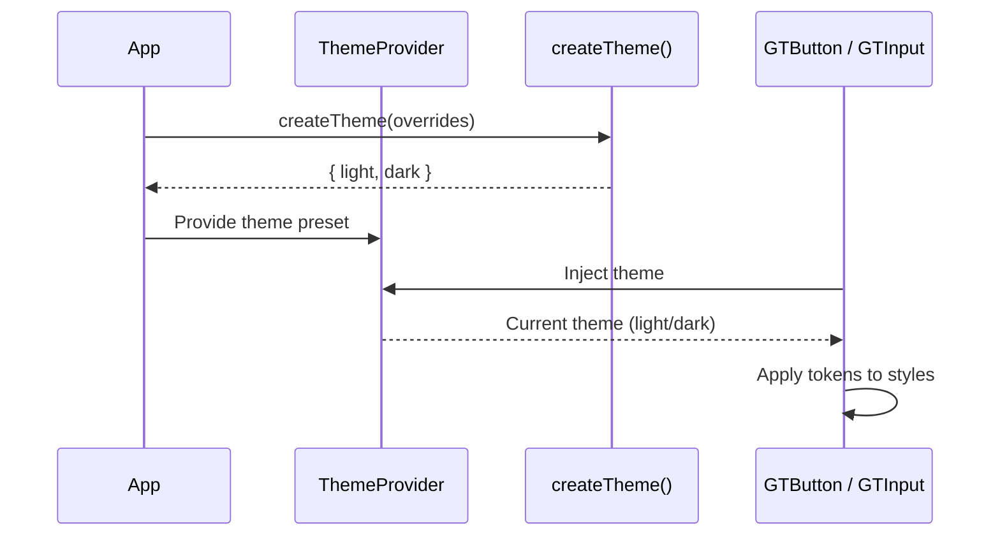

# Package Architecture

Grundtone is a monorepo of packages. Each package has a clear purpose and dependency chain.

## Overview



All packages are scoped under `@grundtone/`. Icons (`@grundtone/icons`) is a standalone package with no Grundtone dependencies — it is opt-in. The framework icon components (`GTIcon`) are generic and accept any icon library that follows the `IconDefinition` contract.

## Packages

### @grundtone/core

**Platform:** All

**What it provides:** Theme types, `createTheme()`, semantic color presets (primary, background,
text, etc.), injection keys, shared type contracts (`IconDefinition`, `IconRegistry`). See [Theme Configuration](/guide/theme-configuration) for how to customize colors.

- No dependencies on other Grundtone packages
- Use this in any framework (Vue, Nuxt, React Native, Plain Web)

```
Install when: You use themes, ThemeProvider, or GrundtoneThemeProvider
```

### @grundtone/icons

**Platform:** All

**What it provides:** Typed SVG icon registry with category grouping. Icons are generated from SVG source files into a TypeScript registry. See [Icons](/icons/) for the full reference.

- No Grundtone dependencies
- Opt-in — only adds bundle weight when installed
- Framework icon components work without this package (pass `icon` prop directly)

```
Install when: You want the built-in icon set
Skip when: You use your own icons or don't need icons
```

### @grundtone/design-system

**Platform:** Web only

**What it provides:** SCSS variables and functions, compiled CSS with `:root` variables, utility
classes (containers, grid, gap, display, flexbox, spacing, container queries). For Plain Web,
override `:root` to customize colors – see
[Theme Configuration](/guide/theme-configuration#plain-web-no-framework).

- Depends on core
- Used by Vue and Plain Web projects that need SCSS or CSS
- All breakpoint values come from a single source of truth (`_breakpoints-defaults.scss`) — see
  [Breakpoints](/web/breakpoints#architecture)

```
Install when: You use Plain Web and need tokens in SCSS/CSS
Skip when: React Native (no CSS/SCSS)
Not needed directly when using @grundtone/vue or @grundtone/nuxt (bundled in)
```

### @grundtone/utils

**Platform:** All (utilities)

**What it provides:** Shared utilities, formatters, validation helpers, validator factory functions (`required()`, `email()`, `minLength()`, etc.).

- Depends on core

```
Install when: You use Vue or Nuxt (pulled in automatically)
Usually not installed directly
```

### @grundtone/vue

**Platform:** Vue (web)

**What it provides:** Vue 3 components, composables (`useTheme`, `useField`, `useFormValidation`), and re-exports of validators. Also re-exports design-system CSS and SCSS via subpath exports. Customize via ThemeProvider `theme` prop –
see [Theme Configuration](/guide/theme-configuration#vue-3).

- Depends on core, design-system, utils
- Subpath exports: `@grundtone/vue/css` (all CSS), `@grundtone/vue/scss/lib` (SCSS tokens)

```
Install when: You use Vue 3 with Vite
Brings in: core, design-system, utils
```

### @grundtone/nuxt

**Platform:** Nuxt 3

**What it provides:** Nuxt module that auto-imports Vue components, composables, and validator factories. Applies theme
from config. Configure `grundtone.theme` – see
[Theme Configuration](/guide/theme-configuration#nuxt-3).

- Depends on vue

```
Install when: You use Nuxt 3
Brings in: vue (and its deps)
```

### @grundtone/react-native

**Platform:** React Native

**What it provides:** `GrundtoneThemeProvider`, `useGrundtoneTheme` hook, `IconRegistryProvider`, `useField` / `useFormValidation` hooks, and re-exported validators. Pass `light` and `dark` from
`createTheme()` – see [Theme Configuration](/guide/theme-configuration#react-native).

- Depends on core, utils
- No design-system (RN uses StyleSheet, not CSS)

```
Install when: You use React Native
Brings in: core, utils
```

## What to Install

| Your setup               | Install                                                     |
| ------------------------ | ----------------------------------------------------------- |
| Vue 3                    | `@grundtone/vue`                                            |
| Vue 3 + icons            | `@grundtone/vue` + `@grundtone/icons`                       |
| Nuxt 3                   | `@grundtone/nuxt`                                           |
| Nuxt 3 + icons           | `@grundtone/nuxt` + `@grundtone/icons`                      |
| React Native             | `@grundtone/react-native`                                   |
| React Native + icons     | `@grundtone/react-native` + `@grundtone/icons`              |
| Plain Web (no framework) | `@grundtone/design-system` + `@grundtone/core`              |

Icons are always opt-in. The framework packages work without `@grundtone/icons` — you can pass icon definitions directly or use your own icon library.

## Design Philosophy: Tokens, Defaults, and Overrides

Every component in Grundtone follows a three-layer model:

### 1. Design system defines the palette

`@grundtone/core` defines all available token values. For border radius, that means nine options
from `none` (0) to `full` (9999px). These are generated into `@grundtone/design-system` as CSS
custom properties (`--radius-none`, `--radius-sm`, `--radius-md`, etc.).

The design system is the **single source of truth**. Components never use hardcoded values — they
always reference tokens.

### 2. Components pick a sensible default

Each component selects a default token from the palette via SCSS. For example, Button uses
`radius('md')` which resolves to `var(--radius-md)`:

```scss
.gt-btn {
  border-radius: tokens.radius('md'); // → var(--radius-md) → 0.375rem
}
```

This means every `<Button>` in your project gets consistent, design-system-driven border radius
without any configuration.

### 3. Props allow per-instance overrides

For the rare cases where a specific button needs to deviate from the default, the component exposes
a prop that is constrained to design-system tokens:

```vue
<!-- 48 buttons use the default md radius -->
<Button>Submit</Button>

<!-- 2 buttons need to be pill-shaped in a specific context -->
<Button rounded="full">Subscribe</Button>
```

The `rounded` prop does not accept arbitrary CSS values — only valid design-system tokens
(`none`, `sm`, `md`, `lg`, `full`). This ensures visual consistency even when overriding.

### Why this matters

- **Consistency**: Every value comes from the design system, never from magic numbers
- **Maintainability**: Change `--radius-md` in one place, every component updates
- **Flexibility**: Components have sensible defaults but can be adjusted when needed
- **Type safety**: TypeScript enforces that only valid token names can be used

This pattern applies to all token-driven properties: colors, spacing, typography, shadows, and
border radius.

## Build Order (Turborepo)

Turborepo builds in dependency order:



1. **core** – no deps
2. **icons** – no Grundtone deps
3. **design-system** – depends on core
4. **utils** – depends on core
5. **vue** – depends on core, design-system, utils
6. **nuxt** – depends on vue
7. **react-native** – depends on core, utils

## Theme Type Hierarchy



## Theme Resolution Flow


