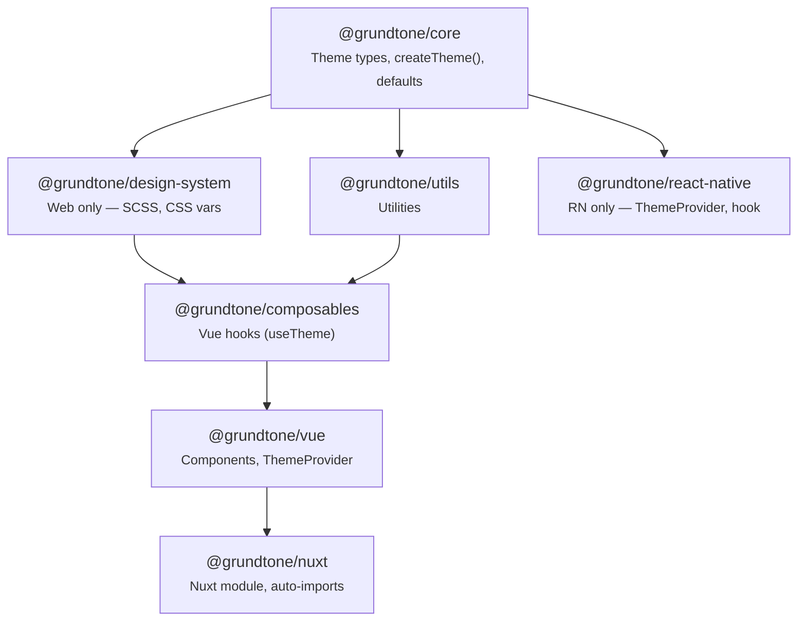

# Package Architecture

Grundtone is a monorepo of packages. Each package has a clear purpose and dependency chain.

## Overview



## Packages

### @grundtone/core

**Platform:** All

**What it provides:** Theme types, `createTheme()`, semantic color presets (primary, background,
text, etc.), injection keys. See [Theme Configuration](/guide/theme-configuration) for how to
customize colors.

- No dependencies on other Grundtone packages
- Use this in any framework (Vue, Nuxt, React Native, Plain Web)

```
Install when: You use themes, ThemeProvider, or GrundtoneThemeProvider
```

### @grundtone/design-system

**Platform:** Web only

**What it provides:** SCSS variables and functions, compiled CSS with `:root` variables, utility
classes (containers, grid, gap, display, flexbox, spacing, container queries). For Plain Web,
override `:root` to customize colors – see
[Theme Configuration](/guide/theme-configuration#plain-web-no-framework).

- No Grundtone dependencies
- Used by Vue and Plain Web projects that need SCSS or CSS
- All breakpoint values come from a single source of truth (`_breakpoints-defaults.scss`) — see
  [Breakpoints](/web/breakpoints#architecture)

```
Install when: You use Vue, Nuxt, or Plain Web and need tokens in SCSS/CSS
Skip when: React Native (no CSS/SCSS)
```

### @grundtone/utils

**Platform:** All (utilities)

**What it provides:** Shared utilities, formatters, validation helpers.

- Depends on core

```
Install when: You use Vue or Nuxt (pulled in automatically)
Usually not installed directly
```

### @grundtone/composables

**Platform:** Vue / Nuxt

**What it provides:** Vue 3 composables (`useTheme`, etc.).

- Depends on core, design-system, shared

```
Install when: You use Vue or Nuxt (pulled in automatically)
```

### @grundtone/vue

**Platform:** Vue (web)

**What it provides:** Vue components (Button, ThemeProvider, ThemeToggle, Icon), theme application
to DOM. Customize via ThemeProvider `theme` prop – see
[Theme Configuration](/guide/theme-configuration#vue-3).

- Depends on core, design-system, shared
- Uses composables (you add it for hooks)

```
Install when: You use Vue 3 with Vite
Brings in: core, design-system, shared
```

### @grundtone/nuxt

**Platform:** Nuxt 3

**What it provides:** Nuxt module that auto-imports Vue components and composables, applies theme
from config. Configure `grundtone.theme` – see
[Theme Configuration](/guide/theme-configuration#nuxt-3).

- Depends on vue, composables

```
Install when: You use Nuxt 3
Brings in: vue, composables (and their deps)
```

### @grundtone/react-native

**Platform:** React Native

**What it provides:** GrundtoneThemeProvider, useGrundtoneTheme hook. Pass `light` and `dark` from
`createTheme()` – see [Theme Configuration](/guide/theme-configuration#react-native).

- Depends only on core
- No design-system (RN uses StyleSheet, not CSS)

```
Install when: You use React Native
Brings in: core only
```

## What to Install

| Your setup               | Install                                        |
| ------------------------ | ---------------------------------------------- |
| Vue 3                    | `@grundtone/vue` + `@grundtone/core`           |
| Nuxt 3                   | `@grundtone/nuxt`                              |
| React Native             | `@grundtone/react-native` + `@grundtone/core`  |
| Plain Web (no framework) | `@grundtone/design-system` + `@grundtone/core` |

## Build Order (Turborepo)

Turborepo builds in dependency order:

1. **core** – no deps
2. **design-system** – no Grundtone deps
3. **shared** – after core
4. **composables** – after core, design-system, shared
5. **vue** – after core, design-system, shared
6. **nuxt** – after vue, composables
7. **react-native** – after core
