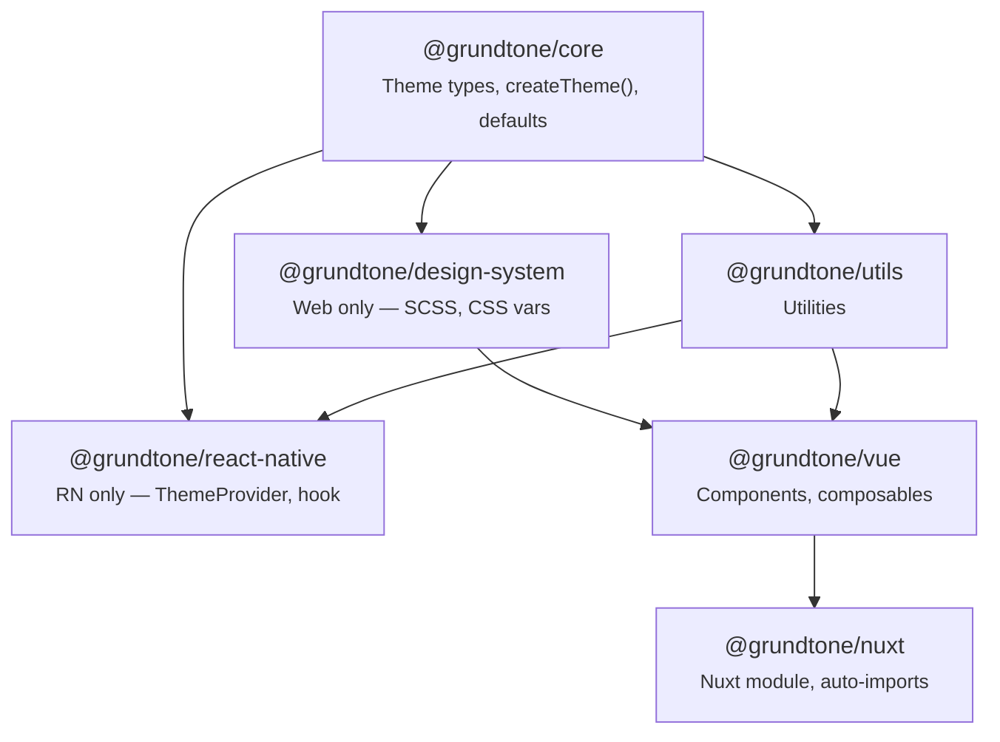

# Package Architecture

Grundtone is a monorepo of packages. Each package has a clear purpose and dependency chain.

## Overview



## Packages

### @grundtone/core

**Platform:** All

**What it provides:** Theme types, `createTheme()`, semantic color presets (primary, background,
text, etc.), injection keys. See [Theme Configuration](/guide/theme-configuration) for how to
customize colors.

- No dependencies on other Grundtone packages
- Use this in any framework (Vue, Nuxt, React Native, Plain Web)

```
Install when: You use themes, ThemeProvider, or GrundtoneThemeProvider
```

### @grundtone/design-system

**Platform:** Web only

**What it provides:** SCSS variables and functions, compiled CSS with `:root` variables, utility
classes (containers, grid, gap, display, flexbox, spacing, container queries). For Plain Web,
override `:root` to customize colors – see
[Theme Configuration](/guide/theme-configuration#plain-web-no-framework).

- No Grundtone dependencies
- Used by Vue and Plain Web projects that need SCSS or CSS
- All breakpoint values come from a single source of truth (`_breakpoints-defaults.scss`) — see
  [Breakpoints](/web/breakpoints#architecture)

```
Install when: You use Vue, Nuxt, or Plain Web and need tokens in SCSS/CSS
Skip when: React Native (no CSS/SCSS)
```

### @grundtone/utils

**Platform:** All (utilities)

**What it provides:** Shared utilities, formatters, validation helpers.

- Depends on core

```
Install when: You use Vue or Nuxt (pulled in automatically)
Usually not installed directly
```

### @grundtone/vue

**Platform:** Vue (web)

**What it provides:** Vue 3 components and composables. Customize via ThemeProvider `theme` prop –
see [Theme Configuration](/guide/theme-configuration#vue-3).

- Depends on core, design-system, utils

```
Install when: You use Vue 3 with Vite
Brings in: core, design-system, utils
```

### @grundtone/nuxt

**Platform:** Nuxt 3

**What it provides:** Nuxt module that auto-imports Vue components and composables, applies theme
from config. Configure `grundtone.theme` – see
[Theme Configuration](/guide/theme-configuration#nuxt-3).

- Depends on vue

```
Install when: You use Nuxt 3
Brings in: vue (and its deps)
```

### @grundtone/react-native

**Platform:** React Native

**What it provides:** GrundtoneThemeProvider, useGrundtoneTheme hook. Pass `light` and `dark` from
`createTheme()` – see [Theme Configuration](/guide/theme-configuration#react-native).

- Depends on core, utils
- No design-system (RN uses StyleSheet, not CSS)

```
Install when: You use React Native
Brings in: core only
```

## What to Install

| Your setup               | Install                                        |
| ------------------------ | ---------------------------------------------- |
| Vue 3                    | `@grundtone/vue` + `@grundtone/core`           |
| Nuxt 3                   | `@grundtone/nuxt`                              |
| React Native             | `@grundtone/react-native` + `@grundtone/core`  |
| Plain Web (no framework) | `@grundtone/design-system` + `@grundtone/core` |

## Design Philosophy: Tokens, Defaults, and Overrides

Every component in Grundtone follows a three-layer model:

### 1. Design system defines the palette

`@grundtone/core` defines all available token values. For border radius, that means nine options
from `none` (0) to `full` (9999px). These are generated into `@grundtone/design-system` as CSS
custom properties (`--radius-none`, `--radius-sm`, `--radius-md`, etc.).

The design system is the **single source of truth**. Components never use hardcoded values — they
always reference tokens.

### 2. Components pick a sensible default

Each component selects a default token from the palette via SCSS. For example, Button uses
`radius('md')` which resolves to `var(--radius-md)`:

```scss
.gt-btn {
  border-radius: tokens.radius('md'); // → var(--radius-md) → 0.375rem
}
```

This means every `<Button>` in your project gets consistent, design-system-driven border radius
without any configuration.

### 3. Props allow per-instance overrides

For the rare cases where a specific button needs to deviate from the default, the component exposes
a prop that is constrained to design-system tokens:

```vue
<!-- 48 buttons use the default md radius -->
<Button>Submit</Button>

<!-- 2 buttons need to be pill-shaped in a specific context -->
<Button rounded="full">Subscribe</Button>
```

The `rounded` prop does not accept arbitrary CSS values — only valid design-system tokens
(`none`, `sm`, `md`, `lg`, `full`). This ensures visual consistency even when overriding.

### Why this matters

- **Consistency**: Every value comes from the design system, never from magic numbers
- **Maintainability**: Change `--radius-md` in one place, every component updates
- **Flexibility**: Components have sensible defaults but can be adjusted when needed
- **Type safety**: TypeScript enforces that only valid token names can be used

This pattern applies to all token-driven properties: colors, spacing, typography, shadows, and
border radius.

## Build Order (Turborepo)

Turborepo builds in dependency order:

1. **core** – no deps
2. **design-system** – no Grundtone deps
3. **utils** – after core
4. **vue** – after core, design-system, utils
5. **nuxt** – after vue
6. **react-native** – after core
